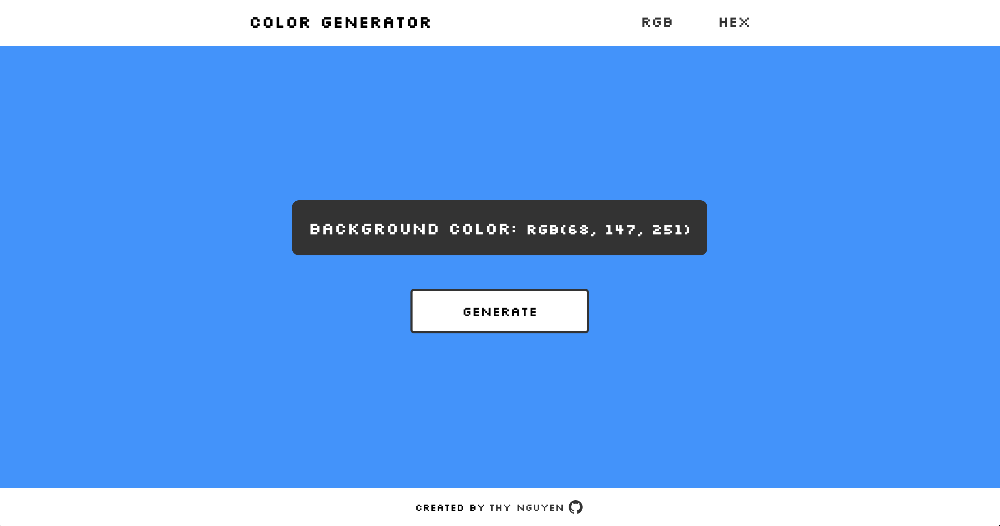

# Ad-hoc projects
This repository was created to host and showcase ad-hoc mini-projects I built with the purpose to improve my frontend skills. Check out my live demo for the following completed projects.

* [Ad-hoc projects](#ad-hoc-projects)
    * [Color generator](#color-generator)

---

### Color generator
A simple web app generates RGB and HEX codes when clicking on the corresponding buttons located in the navbar.

- ⚙️ Built with HTML, SCSS, and JavaScript
- 🔗 Live demo: [Link here](https://thynguyen.dev/adhoc-projects/color-generator/index.html)
