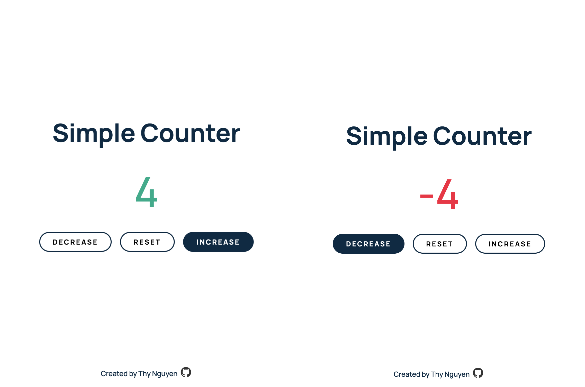

# Ad-hoc projects
This repository was created to host and showcase ad-hoc mini-projects I built with the purpose to improve my frontend skills. Check out my live demo for the following completed projects.

* [Ad-hoc projects](#ad-hoc-projects)
    * [Color generator](#color-generator)
    * [Simple counter](#simple-counter)
    * [Review gallery](#review-gallery)

---

### Color generator
A simple web app generates RGB and HEX codes when clicking on the corresponding buttons located in the navbar.

- ⚙️ Built with HTML, SCSS, and JavaScript
- 🔗 Live demo: [Link here](https://thynguyenxo.github.io/adhoc-projects/color-generator/index.html)

### Simple counter
A simple counter displays positive values in green, negative values are displayed in red, and a reset button to reset back to zero.

- ⚙️ Built with HTML, SCSS, and JavaScript
- 🔗 Live demo: [Link here](https://thynguyenxo.github.io/adhoc-projects/simple-counter/index.html)

### Review gallery
Go through reviews with options to go back and go to the next review, as well as generate a random review by clicking on the 'Surprise Me' button.

- ⚙️ Built with HTML, SCSS, and JavaScript
- 🔗 Live demo: [Link here](https://thynguyenxo.github.io/adhoc-projects/review-gallery/index.html)